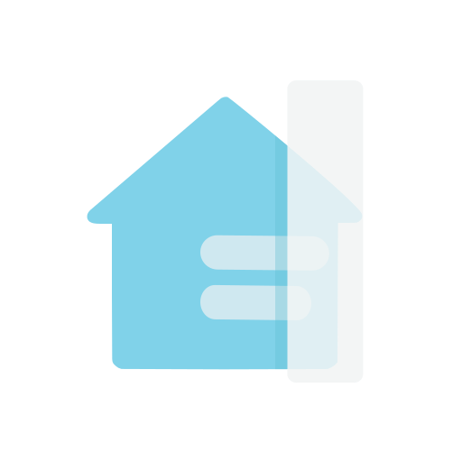

### Hi there, I'm Omri

I'm a Software Engineer passionate about building and shipping products that people love to use. I enjoy the entire process of taking an idea from concept to a live, scalable application.

---

### 🚀 My Featured Project: QuickBars for Home Assistant

<table>
  <tr>
    <td>
      
    </td>
    <td>
      
My flagship project is <strong>QuickBars for Home Assistant</strong>, an Android TV application I built from scratch for the Home Assistant community. It provides users with an elegant and intuitive way to control their smart home devices directly from their TV.

      <ul>
        <li>✅ Achieved over <strong>3,000 downloads</strong> and <strong>250+ paying customers</strong>.</li>
        <li>✅ Built with a modern tech stack including Kotlin & Jetpack Compose.</li>
        <li>✅ Available now on the <a href="https://play.google.com/store/apps/details?id=dev.trooped.tvquickbars&pcampaignid=web_share">Google Play Store</a>.</li>
      </ul>
    </td>
  </tr>
</table>

---

### 🔧 Core Competencies

| Languages         | Data & Integration              | Android TV & UI           | Skills & Methodologies            |
|-------------------|---------------------------------|---------------------------|-----------------------------------|
| Kotlin            | Third-Party Service Integration | Android TV Development    | End-to-End Product Development    |
| Java              | Client-Side Data Management     | Jetpack Compose           | Software Architecture (MVVM)      |
| Python            | SQLite Database Management      | UI/UX Design Principles   | Product Management                |
| C / C++           | Custom Network Protocols        | Android Accessibility API |                                   |

📫 **How to reach me:** You can connect with me on [LinkedIn](https://www.linkedin.com/in/omri-peretz-cs/) or check out my portfolio at [omriperetz.dev](https://omriperetz.dev).
